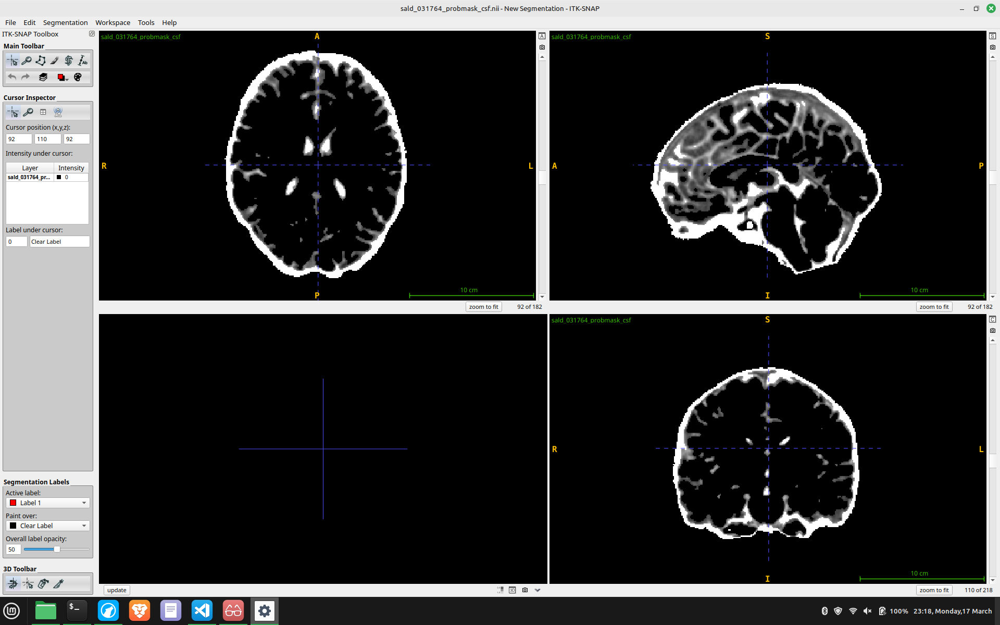
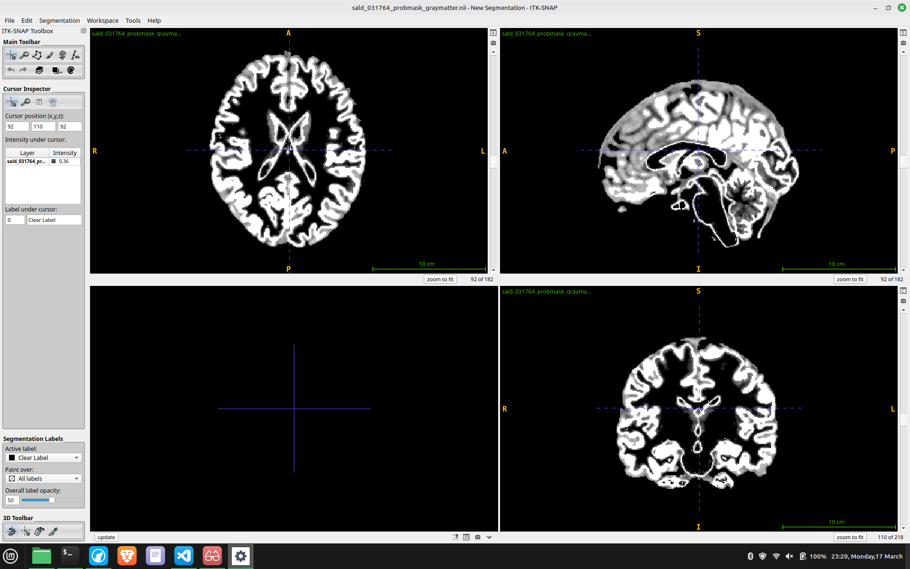
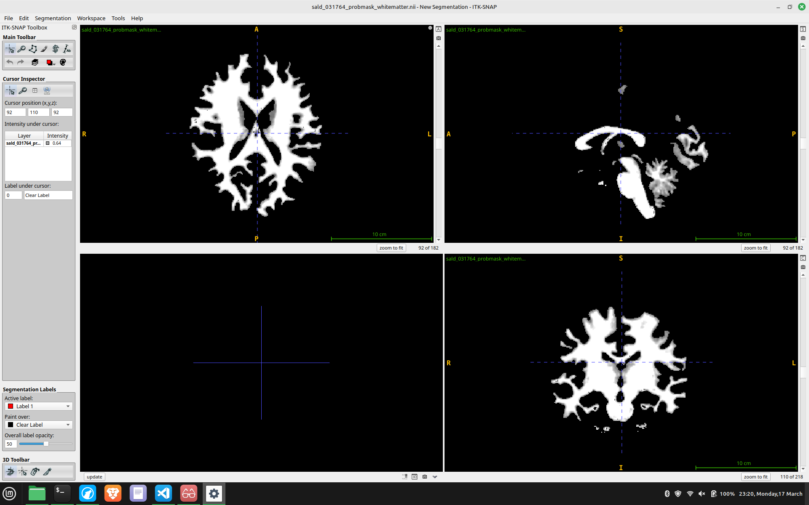
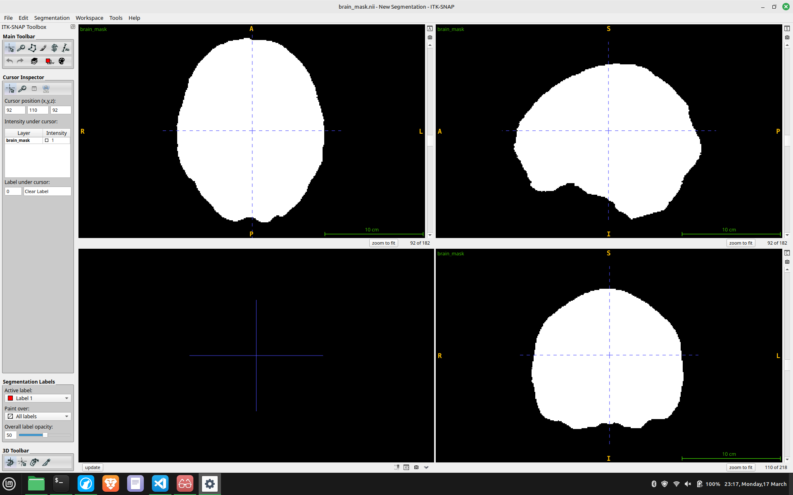
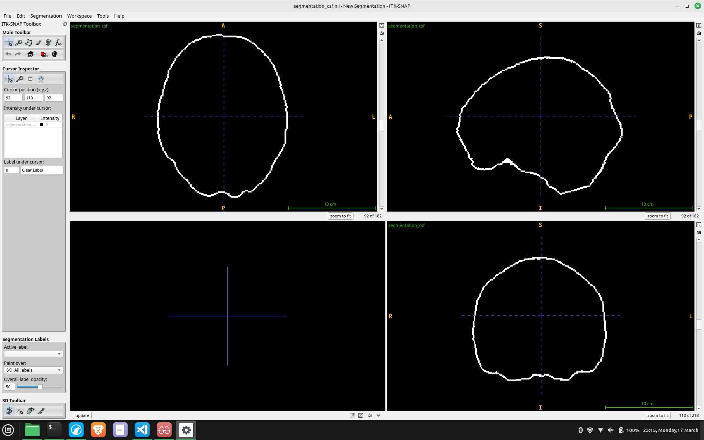
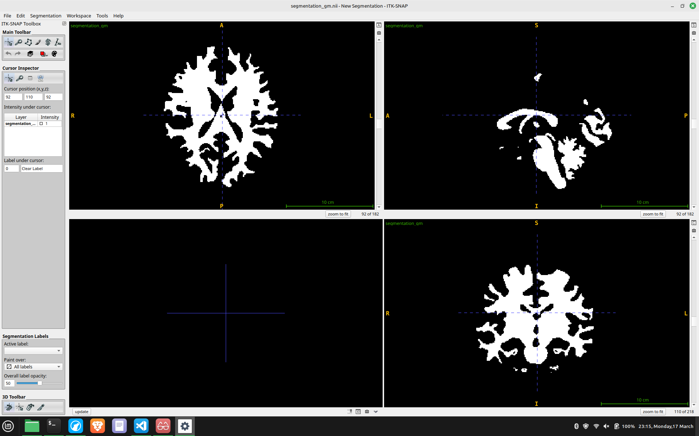
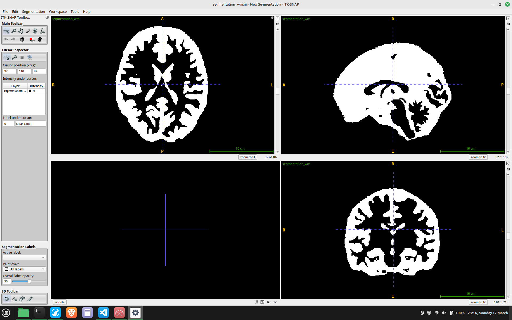

# Brain MRI Segmentation using a Custom Gaussian Mixture Model

This project demonstrates the implementation of a Gaussian Mixture Model (GMM) from scratch in Python and its application to the task of segmenting a brain MRI scan into three primary tissue types: Cerebrospinal Fluid (CSF), Gray Matter (GM), and White Matter (WM).

The core of the project is a custom GMM class built with NumPy, which is then used within a sophisticated pipeline that includes advanced preprocessing, multi-modal feature engineering, and post-processing to achieve accurate segmentation of brain tissue.

## Table of Contents
- [Brain MRI Segmentation using a Custom Gaussian Mixture Model](#brain-mri-segmentation-using-a-custom-gaussian-mixture-model)
  - [Table of Contents](#table-of-contents)
  - [Features](#features)
  - [Results](#results)
    - [Quantitative Results](#quantitative-results)
    - [Visual Results](#visual-results)
      - [Ground Truth (Original Probability Masks)](#ground-truth-original-probability-masks)
      - [Generated Masks and Segmentations](#generated-masks-and-segmentations)
  - [Analysis of Misclassification](#analysis-of-misclassification)
  - [Project Structure](#project-structure)
  - [Setup and Usage](#setup-and-usage)
    - [Prerequisites](#prerequisites)
    - [Installation](#installation)
    - [Running the Segmentation](#running-the-segmentation)

## Features

- **From-Scratch GMM Implementation**: A pure NumPy implementation of the GMM algorithm, including the Expectation-Maximization (EM) steps for model fitting.
- **Advanced Preprocessing**: A robust brain extraction (skull-stripping) pipeline that creates a brain mask using a combination of probability masks, Otsu's thresholding, and morphological operations.
- **Multi-Modal Feature Engineering**: The GMM doesn't just rely on voxel intensity. It uses a rich feature set for more accurate clustering:
    - Voxel Intensity (normalized)
    - 3D Spatial Coordinates
    - Local Variance (a simple texture feature)
    - Prior Probability Maps for CSF, GM, and WM
- **Automated Label Mapping**: Intelligently maps the GMM's output clusters (e.g., 0, 1, 2) to the correct anatomical tissues (CSF, GM, WM) by analyzing mean intensities and overlap with ground-truth probability maps.
- **Quantitative and Qualitative Analysis**: Provides pointwise accuracy metrics against ground-truth masks and saves the resulting segmentations as NIfTI files for visualization in software like ITK-SNAP.

## Results

The model was trained on the `sald_031764_img.nii` dataset and evaluated against the provided probability masks.

### Quantitative Results

The pointwise accuracy was calculated for the voxels within the generated brain mask.

| Metric                        | Score   |
| ----------------------------- | ------- |
| **Overall Accuracy**          | **0.7828**  |
| CSF Accuracy                  | 0.2593  |
| Gray Matter (GM) Accuracy     | 1.0000  |
| White Matter (WM) Accuracy    | 0.9504  |

The model achieves excellent accuracy for Gray and White Matter. The lower accuracy for CSF is a common challenge, often due to its lower volume, variable intensity, and proximity to non-brain tissues.

### Visual Results

The following images show a comparison between the original probability masks and the final segmentation produced by the GMM. All images are screenshots from a central axial slice.

#### Ground Truth (Original Probability Masks)

**Original CSF Mask**


**Original Gray Matter Mask**


**Original White Matter Mask**


---

#### Generated Masks and Segmentations

**Brain Mask (Created by script)**


**Predicted CSF Segmentation**


**Predicted Gray Matter Segmentation**


**Predicted White Matter Segmentation**


## Analysis of Misclassification

The highest misclassification likely occurs at the **gray matter-white matter boundary**. This is due to several factors:

- **Overlapping Intensity Distributions**: Gray matter and white matter have partially overlapping intensity values in MRI scans. While white matter is generally brighter, the distributions are not perfectly separable, leading to ambiguity for the GMM.
- **Partial Volume Effects**: At the limited resolution of MRI, voxels at the boundary between two tissue types often contain a mixture of both. These "partial volume" voxels have intermediate intensity values that are difficult to assign to a single class.
- **Tissue Interface Complexity**: The boundary between gray and white matter is anatomically complex, with many folds and curves (gyri and sulci). An intensity-based model like GMM struggles to perfectly capture this complex geometry.
- **Gray Matter's "Middle Position"**: Gray matter's intensity distribution sits between the low intensity of CSF and the high intensity of white matter, making it susceptible to being misclassified as either tissue type depending on local variations.

## Project Structure

```
.
├── assets
│   └── gmm
│       ├── original
│       │   ├── csf-original.png
│       │   ├── gm-original.png
│       │   └── wm-original.png
│       └── predicted
│           ├── brain-mask-created.png
│           ├── csf-predicted.png
│           ├── gm-predicted.png
│           └── wm-predicted.png
├── datasets
│   └── gmm
│       ├── sald_031764_img.nii
│       ├── sald_031764_probmask_csf.nii
│       ├── sald_031764_probmask_graymatter.nii
│       └── sald_031764_probmask_whitematter.nii
├── segmentation_results/  <- Generated by the script
│   ├── brain_mask.nii
│   ├── segmentation_all.nii
│   ├── segmentation_csf.nii
│   ├── segmentation_gm.nii
│   ├── segmentation_wm.nii
│   └── segmentation_visualization.png
├── gmm.ipynb
└── README.md
```

## Setup and Usage

### Prerequisites

- Python 3.8+
- Jupyter Notebook or JupyterLab

### Installation

1.  **Clone the repository:**
    ```bash
    git clone git@github.com:ashurudra09/GMM-for-brain-segmentation.git
    cd GMM-for-brain-segmentation
    ```

2.  **Download the data:**
    Download the NIfTI files from the provided source and place them in the `datasets/gmm/` directory as shown in the [Project Structure](#project-structure).

3.  **Install the required Python libraries:**
    A `requirements.txt` file is recommended for easy setup.
    ```bash
    pip install numpy nibabel scikit-learn matplotlib scipy scikit-image jupyter
    ```

### Running the Segmentation

1.  **Start Jupyter:**
    ```bash
    jupyter notebook
    ```
2.  **Open and run the notebook:**
    Open the `gmm.ipynb` file in your browser and run all the cells.

The script will:
- Load the MRI data.
- Perform preprocessing and feature extraction.
- Fit the GMM model, printing the log-likelihood at each iteration.
- Predict the tissue classes.
- Print the final accuracy report to the console.
- Save the final segmentation masks as `.nii` files in the `segmentation_results/` directory.

You can then open the original MRI (`sald_031764_img.nii`) and the generated segmentation (`segmentation_results/segmentation_all.nii`) in a medical image viewer like [ITK-SNAP](http://www.itksnap.org/) to visually inspect the results.

---